# PongGPT
I write PingPong with some weird requirements just by ChatGPT.
Requirements:
- 2 balls 
- 2 Players
- Players can move in 4 directions

[Video](docs/PongGPT.mov)
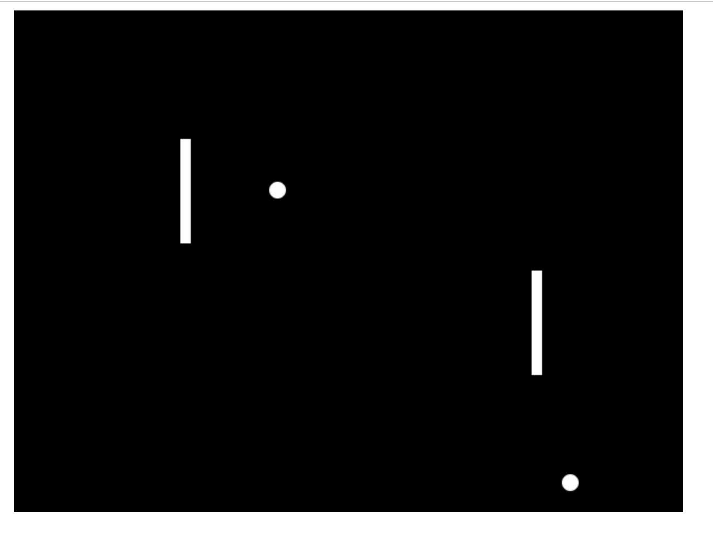

## Prompts steps

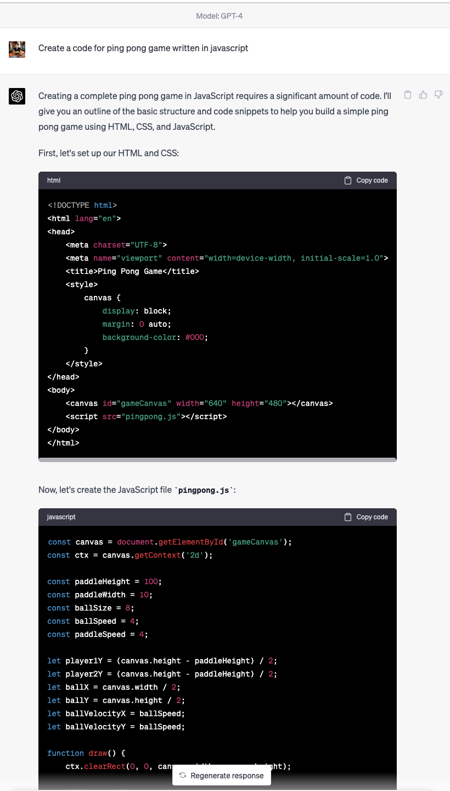
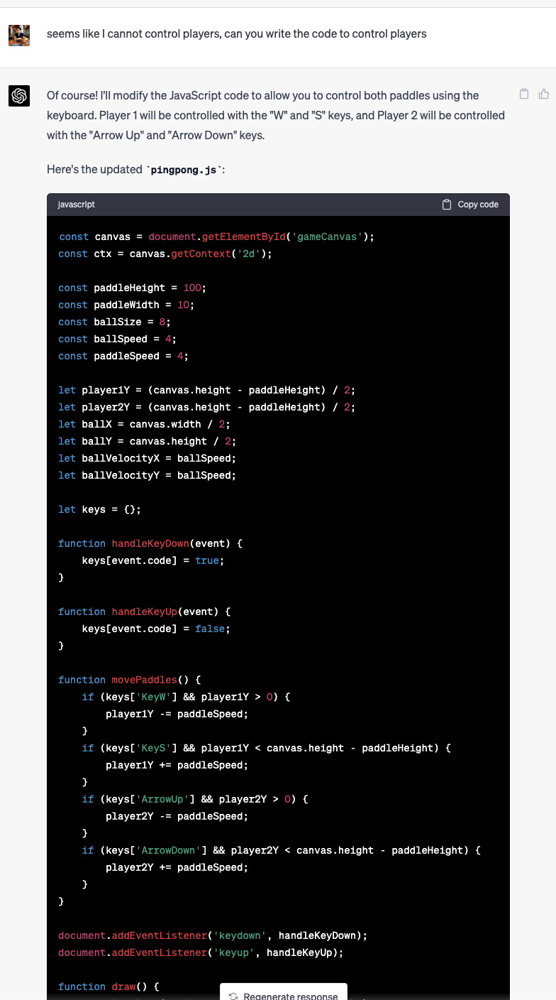
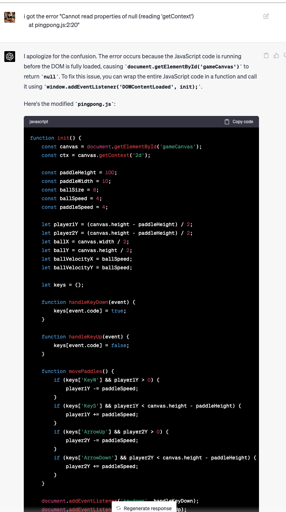

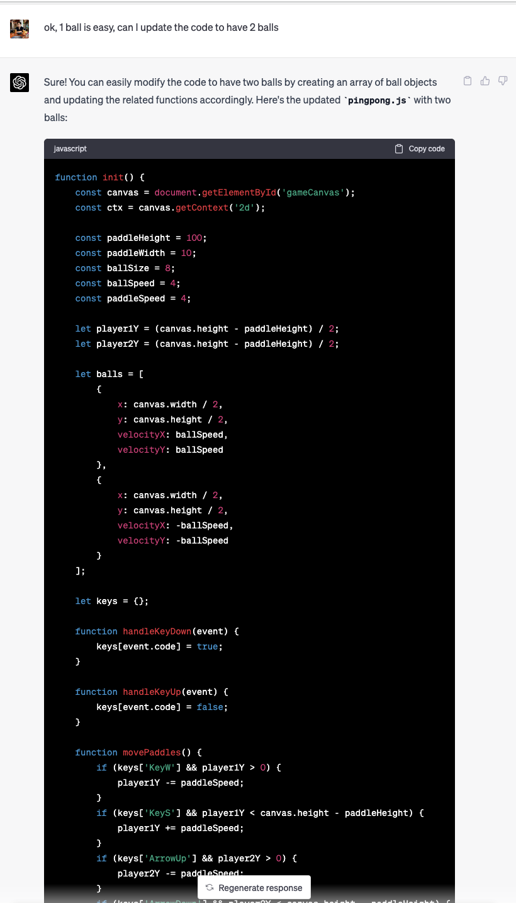
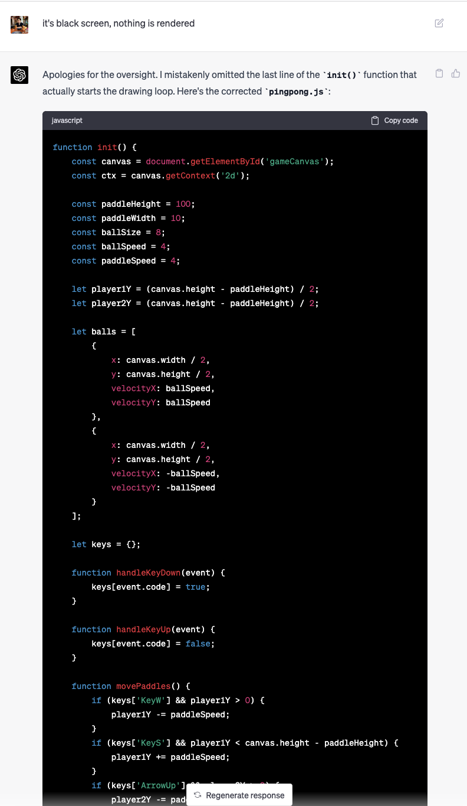
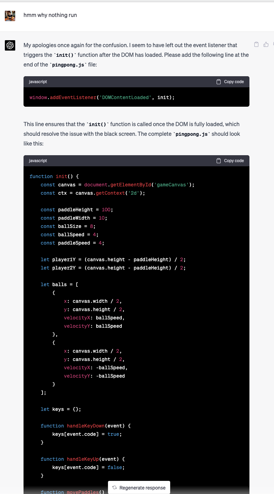
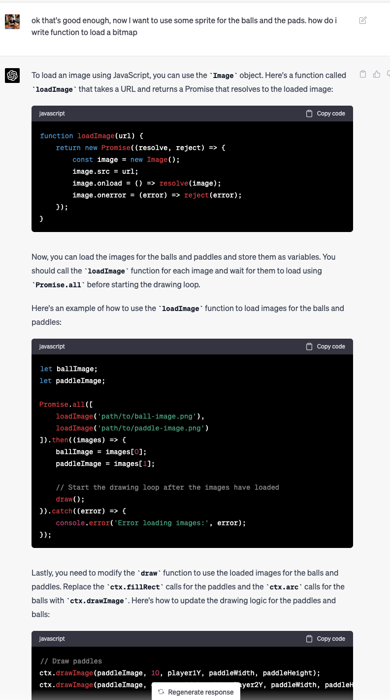
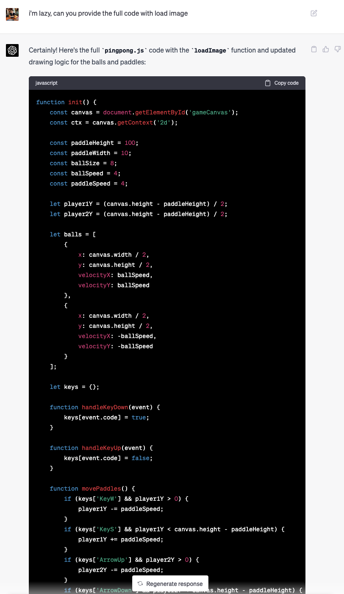
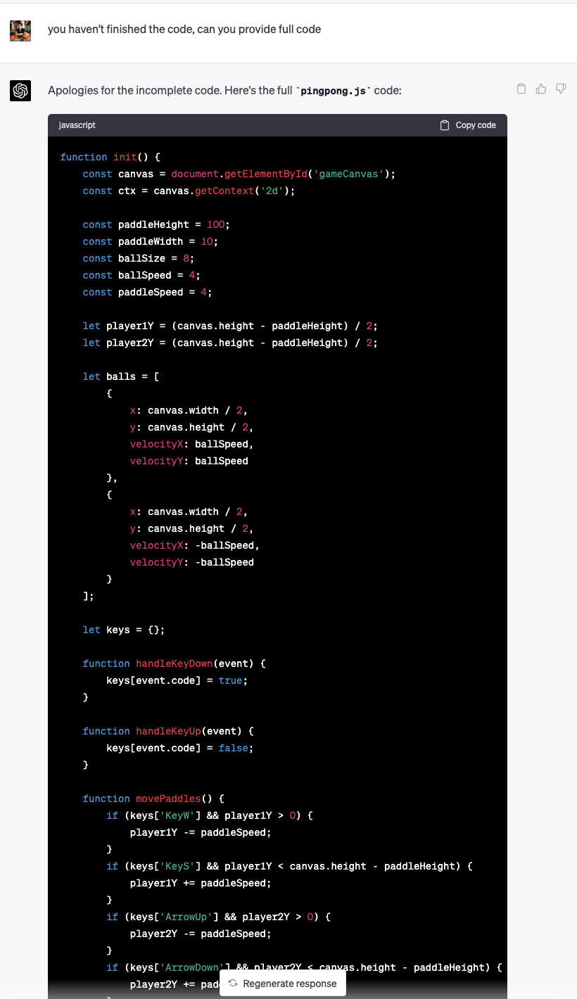
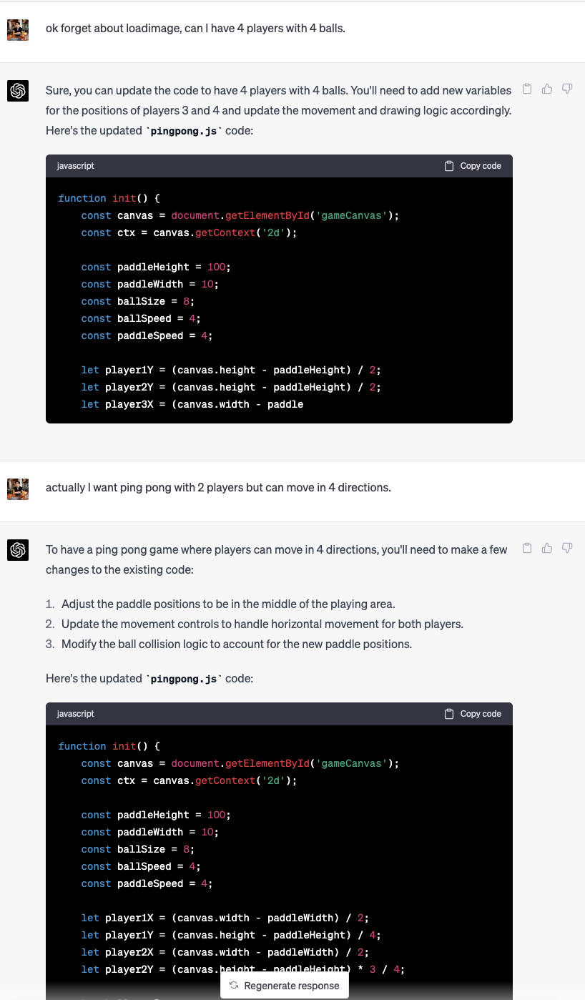
